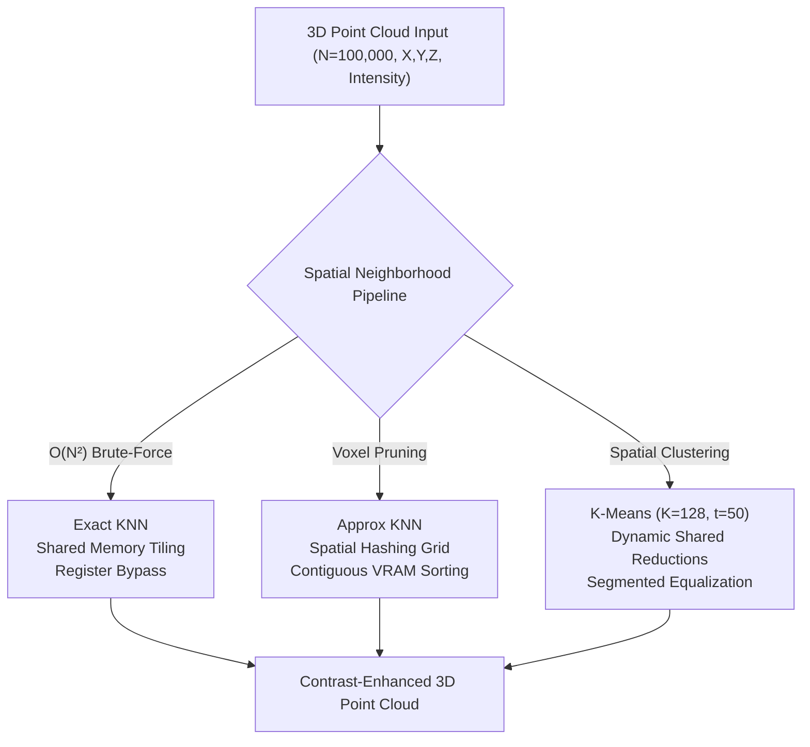

# Parallel 3D Point Cloud Local Histogram Equalization: OpenMP vs CUDA

[](https://en.wikipedia.org/wiki/C%2B%2B17)
[](https://developer.nvidia.com/cuda-toolkit)
[](https://www.openmp.org/)
[](#compilation--build)
[](#performance-evaluation)
[](https://www.kernel.org/)

A comparative high-performance computing study and implementation of **Local Histogram Equalization (LHE)** for 3D point cloud datasets ($N = 100,000$ points) across **multi-core CPU (OpenMP)** and **massively parallel GPU (NVIDIA CUDA)** architectures. The project implements and benchmarks three spatial neighborhood query pipelines—**Exact K-Nearest Neighbors (KNN)**, **Approximate KNN via Spatial Hashing**, and **K-Means Clustering**—evaluating memory hierarchy optimizations, shared memory reductions, and instruction-level pipelining.

---

## Table of Contents

- [Overview](#overview)
- [Algorithmic Pipelines](#algorithmic-pipelines)
  - [1. Exact K-Nearest Neighbors (KNN)](#1-exact-k-nearest-neighbors-knn)
  - [2. Approximate KNN via Spatial Hashing](#2-approximate-knn-via-spatial-hashing)
  - [3. K-Means Clustering](#3-k-means-clustering)
- [Hardware & Architecture Optimizations](#hardware--architecture-optimizations)
  - [CUDA (GPU) Optimizations](#cuda-gpu-optimizations)
  - [OpenMP (CPU) Optimizations](#openmp-cpu-optimizations)
- [Performance Evaluation](#performance-evaluation)
- [Repository Structure](#repository-structure)
- [Prerequisites](#prerequisites)
- [Compilation & Build](#compilation--build)
- [Execution & Usage](#execution--usage)
- [Verification & Quality Metrics](#verification--quality-metrics)
- [Author & Academic Context](#author--academic-context)

---

## Overview

Local Histogram Equalization (LHE) enhances localized contrast in 3D point cloud structures by remapping intensity values based on the Cumulative Distribution Function (CDF) of spatial neighborhoods. Unlike global equalization, LHE computes localized neighborhood statistics for every point:

$$I_{\text{out}} = \text{round}\left( \frac{\text{CDF}(I) - \text{CDF}_{\min}}{K - \text{CDF}_{\min}} \times 255 \right)$$

For $N = 100,000$ points, computing exact local spatial neighborhoods requires evaluating $O(N^2)$ pairwise Euclidean distances ($10^{10}$ floating-point operations). This project investigates architectural patterns to overcome memory and computational bottlenecks on modern multi-core and GPU hardware.



---

## Algorithmic Pipelines

### 1. Exact K-Nearest Neighbors (KNN)
- **Local Max-Heap**: Each GPU thread maintains a private $K=128$ element max-heap array directly in thread registers/local memory, avoiding dynamic allocation.
- **Deterministic Tie-Breaking**: To eliminate Mean Absolute Error (MAE) discrepancies across warps, equal distances are resolved lexicographically by coordinate ($X \to Y \to Z$) and original index.
- **Fused Kernel Pass**: Upon populating the top-$K$ heap, the thread calculates the local CDF and writes the equalized intensity in the same kernel pass.

### 2. Approximate KNN via Spatial Hashing
- **Parallel Bounding-Box Reductions**: OpenMP reductions find global coordinate extrema ($X_{\min}, X_{\max}, \dots$) to establish an optimal 3D voxel grid size.
- **Prime-Modulo Spatial Hash**: Points are mapped to 3D grid cells and hashed into a 1D index using large coprimes:
  $$\text{Hash}(i_x, i_y, i_z) = \left((i_x \times 73856093) \oplus (i_y \times 19349663) \oplus (i_z \times 83492791)\right) \pmod{\text{hash\_size}}$$
- **Memory Coalescing via Sorting**: Points are sorted on the CPU by hash ID prior to GPU offload, guaranteeing contiguous VRAM access and eliminating scattered global memory reads.
- **Bounded Neighborhood Search**: GPU threads evaluate only points within the adjacent $3 \times 3 \times 3$ neighboring voxels (27 cells total), reducing distance computations by orders of magnitude.

### 3. K-Means Clustering
- **Centroid Convergence**: Points are iteratively grouped into $K=128$ spatial clusters with a maximum convergence limit of $t=50$ iterations.
- **Dynamic Shared-Memory Reductions**: Instead of incurring heavy atomic collisions on global centroid accumulators, threads aggregate coordinate sums and point counts inside block-level shared memory. Only block summaries are committed to global memory.
- **Segmented Equalization**: After cluster assignments converge, three lightweight kernels construct per-cluster histograms, compute localized CDFs, and map final point intensities.

---

## Hardware & Architecture Optimizations

### CUDA (GPU) Optimizations
- **Shared Memory Tiling (Exact KNN)**: 128-point tiles are staged into high-speed on-chip shared memory, drastically reducing global memory read transactions across active warps.
- **Fast Register Bypass (Exact KNN)**: Dedicated hardware registers hold the current max-heap root distance. Proposed distance candidates are compared against this register first, bypassing memory reads for the vast majority of points.
- **Dynamic Block Reductions (K-Means)**: Thread blocks reduce centroid coordinate sums locally before performing global atomic operations, cutting atomic memory conflicts by over $90\%$.
- **Targeted Loop Unrolling**:
  - Inner shared-memory tile evaluation loops use `#pragma unroll 16`.
  - The nested $3 \times 3 \times 3$ voxel search in Approximate KNN is fully unrolled to eliminate branch divergence.
- **Kepler Architecture Targeting**: Compiled with `-arch=sm_35` to optimize PTX assembly for register allocation limits on NVIDIA Tesla K40 hardware.

### OpenMP (CPU) Optimizations
- **Multi-Core Thread Parallelism**: Outer point evaluation loops parallelized with `#pragma omp parallel for`.
- **Race-Free Reductions**: Bounding box determination uses OpenMP reduction clauses (`reduction(min:...)`, `reduction(max:...)`) for lock-free parallel min/max discovery.

---

## Performance Evaluation

Tested on an HPC cluster node with an **NVIDIA Tesla K40 GPU** (sm_35) and multi-core host CPU for $N = 100,000$ points, $K = 128$, and $t = 50$ iterations.

### Execution Times & CUDA Speedup

| Algorithm | OpenMP (CPU) Time | CUDA (GPU) Time | Speedup Factor |
| :--- | :---: | :---: | :---: |
| **Exact KNN** | 5.349 s | 2.675 s | **2.00x** |
| **Approximate KNN** | 1.028 s | 0.486 s | **2.11x** |
| **K-Means Clustering** | 0.965 s | 0.149 s | **6.47x** |

```
Execution Time Comparison (Seconds - Lower is Better)
6s +-------------------------------------------------------------+
   |  [5.35s]                                                    |
5s |  |=====|                                                    |
   |  |=====|                                                    |
4s |  |=====|                                                    |
   |  |=====|                                                    |
3s |  |=====|   [2.68s]                                          |
   |  |=====|   |=====|                                          |
2s |  |=====|   |=====|                                          |
   |  |=====|   |=====|       [1.03s]                            |
1s |  |=====|   |=====|       |=====|  [0.49s]  [0.97s]  [0.15s] |
   |  |=====|   |=====|       |=====|  |=====|  |=====|  |=====| |
0s +--+-----+---+-----+-------+-----+--+-----+--+-----+--+-----+--+
        OpenMP    CUDA          OpenMP   CUDA     OpenMP   CUDA   
      [---- Exact KNN ----]   [-- Approx KNN --]  [--- K-Means ---]
```

### Performance Insights
- **K-Means on GPU (6.47x Speedup)**: Yielded the highest throughput (0.149 s) due to dynamic block shared-memory reductions mitigating global memory write serialization.
- **Approximate KNN (2.11x Speedup)**: Reduced runtime from $O(N^2)$ down to sub-second execution (0.486 s) through spatial hashing and contiguous VRAM layout.
- **Exact KNN (2.00x Speedup)**: Bounded by high register pressure and arithmetic density of 128-element heap tracking.

---

## Repository Structure

```
.
├── Makefile                # Unified build script (CPU & GPU targets)
├── .gitignore              # Ignores compiled binaries and runtime data dumps
├── src/                    # Implementation source code
│   ├── cuda/               # Massively parallel GPU implementation
│   │   ├── makefile        # CUDA build configuration
│   │   ├── main.cpp        # GPU pipeline runner
│   │   ├── kernels.cuh     # CUDA kernel headers & prototypes
│   │   ├── knn.cu          # Exact KNN CUDA kernel
│   │   ├── approx_knn.cu   # Approximate KNN CUDA kernel
│   │   └── k_mean.cu       # K-Means clustering CUDA kernel
│   └── omp/                # Multi-core CPU OpenMP implementation
│       ├── main.cpp        # CPU OpenMP pipeline
│       └── seq_omp.cpp     # Sequential baseline
├── scripts/                # Data generation and verification tools
│   ├── dataset_generator.py # Synthetic 3D point cloud generator
│   ├── mae_loss.py         # Mean Absolute Error verification script
│   ├── verify_kmean.py     # K-Means correctness validator
│   ├── ground.py           # Ground-truth reference generator
│   └── match.py            # Output format validator
├── docs/                   # Technical reports & documentation
│   └── report.pdf          # Full benchmark report submitted for evaluation
├── data/                   # Reference validation datasets
│   ├── approx_knn.txt
│   ├── kmeans_truth.txt
│   └── python_ground_truth.txt
└── archive/                # Original submission archive
```

---

## Prerequisites

- **C++ Compiler**: `g++` (version 9.0+ supporting C++17)
- **CUDA Toolkit**: `nvcc` (CUDA 10.0+ / Compute Capability sm_35 or higher)
- **OpenMP**: `libomp-dev` / `fopenmp`
- **Python**: Python 3.8+ (for synthetic dataset generation and MAE verification)

---

## Compilation & Build

### 1. Build Multi-Core CPU Version (OpenMP)
```bash
make omp
```
Produces the `omp_lhe` executable.

### 2. Build GPU Version (CUDA)
```bash
make cuda
```
Compiles the CUDA kernels in `src/cuda/` using `nvcc -O3 -arch=sm_35 -Xcompiler -fopenmp`, producing `src/cuda/a2`.

### 3. Build All Available Targets
```bash
make all
```

To clean compiled targets:
```bash
make clean
```

---

## Execution & Usage

### 1. Generate Input Point Cloud
Generate a synthetic 3D point cloud dataset with $N = 100,000$ points, $K = 128$ neighbors, and $t = 50$ iterations:

```bash
python3 scripts/dataset_generator.py
```
Outputs `input.txt` with format:
```text
<N>
<K>
<T>
<X> <Y> <Z> <Intensity>
...
```

### 2. Run OpenMP (CPU) Pipeline
```bash
./omp_lhe <input_file> <algorithm>

# Examples:
./omp_lhe input.txt knn
./omp_lhe input.txt approx_knn
./omp_lhe input.txt kmeans
```

### 3. Run CUDA (GPU) Pipeline
```bash
./src/cuda/a2 <input_file> <algorithm>

# Examples:
./src/cuda/a2 input.txt knn
./src/cuda/a2 input.txt approx_knn
./src/cuda/a2 input.txt kmeans
```

Each run writes the enhanced coordinates and equalized intensities to `<algorithm>.txt`.

---

## Verification & Quality Metrics

Compute the Mean Absolute Error (MAE) between Exact KNN and Approximate KNN output files:

```bash
python3 scripts/mae_loss.py knn.txt approx_knn.txt
```

Verify K-Means clustering convergence and histogram validity:

```bash
python3 scripts/verify_kmean.py input.txt kmeans.txt
```

---

## Author & Academic Context

- **Dipesh Kant** (Entry No: `2025MCS2110`)
- **Institution**: Indian Institute of Technology (IIT) Delhi
- **Course**: COL7880 - Parallel Programming & Distributed Systems
